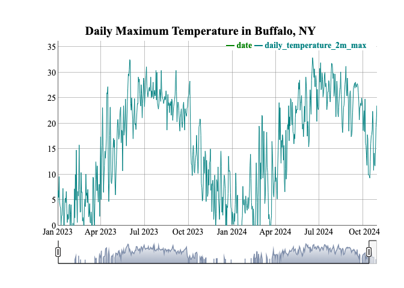
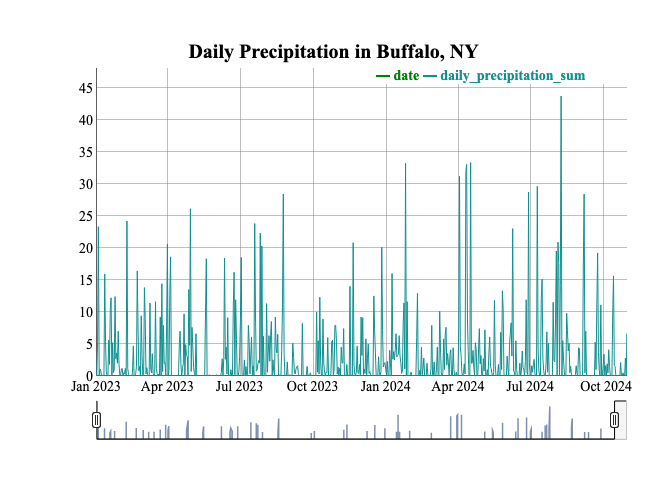

Case Study 12
================
Jeongwon Lee
November 19, 2024

# Tasks

- Download daily weather data for Buffalo, NY using an API

- Generate a dynamic html visualization of the timeseries.

- Save the graph to your project folder using Export-\>Save as Webpage

# Import libraries

``` r
# install.packages("widgetframe")
library(tidyverse)
```

    ## ── Attaching core tidyverse packages ──────────────────────── tidyverse 2.0.0 ──
    ## ✔ dplyr     1.1.4     ✔ readr     2.1.5
    ## ✔ forcats   1.0.0     ✔ stringr   1.5.1
    ## ✔ ggplot2   3.5.1     ✔ tibble    3.2.1
    ## ✔ lubridate 1.9.3     ✔ tidyr     1.3.0
    ## ✔ purrr     1.0.2     
    ## ── Conflicts ────────────────────────────────────────── tidyverse_conflicts() ──
    ## ✖ dplyr::filter() masks stats::filter()
    ## ✖ dplyr::lag()    masks stats::lag()
    ## ℹ Use the conflicted package (<http://conflicted.r-lib.org/>) to force all conflicts to become errors

``` r
library(htmlwidgets)
library(widgetframe)
library(dplyr)
library(ggplot2)
```

# Download data

``` r
library(xts)
```

    ## Loading required package: zoo

    ## 
    ## Attaching package: 'zoo'

    ## The following objects are masked from 'package:base':
    ## 
    ##     as.Date, as.Date.numeric

    ## 
    ## ######################### Warning from 'xts' package ##########################
    ## #                                                                             #
    ## # The dplyr lag() function breaks how base R's lag() function is supposed to  #
    ## # work, which breaks lag(my_xts). Calls to lag(my_xts) that you type or       #
    ## # source() into this session won't work correctly.                            #
    ## #                                                                             #
    ## # Use stats::lag() to make sure you're not using dplyr::lag(), or you can add #
    ## # conflictRules('dplyr', exclude = 'lag') to your .Rprofile to stop           #
    ## # dplyr from breaking base R's lag() function.                                #
    ## #                                                                             #
    ## # Code in packages is not affected. It's protected by R's namespace mechanism #
    ## # Set `options(xts.warn_dplyr_breaks_lag = FALSE)` to suppress this warning.  #
    ## #                                                                             #
    ## ###############################################################################

    ## 
    ## Attaching package: 'xts'

    ## The following objects are masked from 'package:dplyr':
    ## 
    ##     first, last

``` r
library(dygraphs)
library(openmeteo)
d <- weather_history(c(43.00923265935055, -78.78494250958327),start = "2023-01-01",end=today(),
                  daily=list("temperature_2m_max","temperature_2m_min","precipitation_sum")) %>% 
  mutate(daily_temperature_2m_mean=(daily_temperature_2m_max+daily_temperature_2m_min)/2)
```

# 1. Convert data into xts data

``` r
# convert data in to an xts time series object
d.temp.xts <- d %>% select("date", "daily_temperature_2m_max") %>%
  filter(!is.na(daily_temperature_2m_max)) %>% as.xts(order.by = .$date)

d.prec.xts <- d %>% select("date", "daily_precipitation_sum") %>%
  filter(!is.na(daily_precipitation_sum)) %>% as.xts(order.by = .$date)
```

# 2. Plot dygraph of temperature

``` r
# dygraph of temperature
dygraph(d.temp.xts, main = "Daily Maximum Temperature in Buffalo, NY") %>%
  dySeries("daily_temperature_2m_max", color = "#008080") %>%
  dyRangeSelector(dateWindow = c("2023-01-01", "2024-10-31"))
```

<!-- -->

# 3. Plot dygraph of precipitation

``` r
# dygraph of precipitation
dygraph(d.prec.xts, main = "Daily Precipitation in Buffalo, NY") %>%
  dySeries("daily_precipitation_sum", color = "#109090") %>%
  dyRangeSelector(dateWindow = c("2023-01-01", "2024-10-31"))
```

<!-- -->
